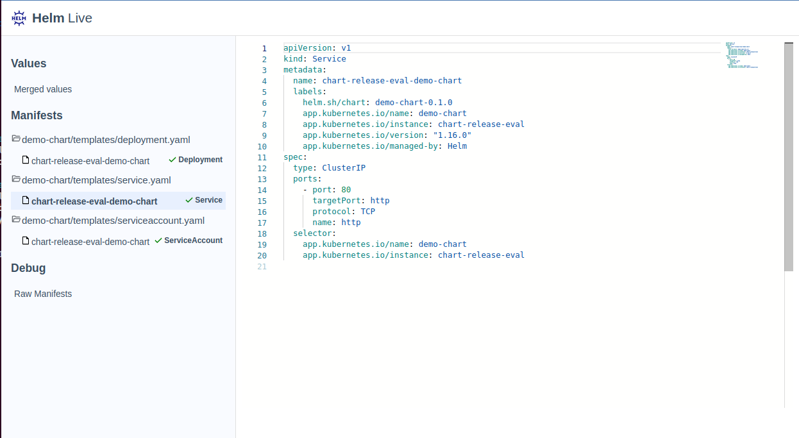

# Helm Live

Helm live is a project to render helm charts in the browser. 
It is a tool to help helm developers to visualize their charts and values in a more interactive way.


## Why Helm Live

When you need to create or use and chart, you need to view the rendering of your go template.
You can use `helm template` command to see it. But the result is not always convenient (particulary for big chart)
And you simply validate that the templating worked well but not that the resulting manifest are valid kubernetes resources.

Helm live will process to :
 - A live rendering of you chart
 - Resource live validation using kubeconform


## Usage


```bash
helm-live \
  --static-path=./ui/dist/helm-live/browser \
  --chart-path=./helm-demo \
  --value-file=./helm-demo/values-example.yaml 
```

The open your browser and go to `http://localhost:8085/ui/`


## Screeshoot




## Development

```bash
go mod tidy                
go mod vendor
GIT_TERMINAL_PROMPT=1 GO111MODULE=on go build -o helm-live   ./cmd/live/live.go 
```